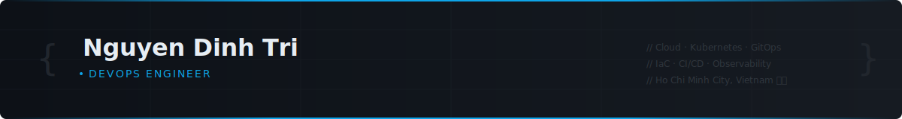

  

 

## About

Computer Networking & Data Communications student at UIT — VNU-HCM, building toward a career in DevOps and Cloud Engineering.

- Designing and deploying cloud-native infrastructure on AWS with Kubernetes, GitOps, and IaC
- Automating delivery pipelines using GitHub Actions, ArgoCD, and container-based workflows
- Implementing observability stacks (Prometheus, Grafana) and security controls on EKS clusters
- Focused on platform reliability, infrastructure automation, and developer experience
- Seeking a **DevOps Engineer Internship** — open to remote or Ho Chi Minh City

 

## Tech Stack

**Cloud**

**Containers & Orchestration**

**Infrastructure as Code**

**CI/CD & GitOps**

**Monitoring**

**Programming**

**Networking**

 

## Projects

**[Cloud-Native Secure GitOps Platform on AWS EKS](https://github.com/dinhtri6905/gitops-eks-platform)**
Production-grade GitOps platform on AWS EKS — Terraform-provisioned multi-environment clusters, ArgoCD App-of-Apps delivery, Istio service mesh with mTLS, and automated image scanning via Trivy in GitHub Actions pipelines.
`Terraform` `EKS` `ArgoCD` `Istio` `GitHub Actions` `Trivy`

---

**[Kubernetes Monitoring Stack](https://github.com/dinhtri6905/k8s-monitoring-stack)**
Full-stack observability for Kubernetes — kube-prometheus-stack deployed with Helm, custom Grafana dashboards for cluster and workload visibility, Loki log aggregation, and Alertmanager routing to Slack and email.
`Prometheus` `Grafana` `Loki` `Alertmanager` `Helm` `Kubernetes`

---

**[Infrastructure as Code with Terraform](https://github.com/dinhtri6905/aws-terraform-iac)**
Modular Terraform library for AWS infrastructure — VPC, EKS, RDS, ALB, and IAM following the AWS Well-Architected Framework. Remote state in S3 with DynamoDB locking, Atlantis for GitOps-style plan/apply workflows.
`Terraform` `AWS` `Terragrunt` `GitHub Actions` `Atlantis`

---

**[CI/CD Automation Platform](https://github.com/dinhtri6905/cicd-automation-platform)**
Reusable GitHub Actions workflow library for containerized microservices — semantic versioning, SAST with SonarQube, container scanning, Argo Rollouts for canary deployments, and Slack notifications with deployment context.
`GitHub Actions` `Docker` `SonarQube` `Argo Rollouts` `ArgoCD`

 

## GitHub Statistics

  
  

  

 

## Contribution

  <picture>
    <source media="(prefers-color-scheme: dark)" srcset="https://raw.githubusercontent.com/dinhtri6905/dinhtri6905/output/github-contribution-grid-snake-dark.svg"/>
    <source media="(prefers-color-scheme: light)" srcset="https://raw.githubusercontent.com/dinhtri6905/dinhtri6905/output/github-contribution-grid-snake.svg"/>
    
  </picture>

 

## Connect

---

  Ho Chi Minh City, Vietnam · UIT — VNU-HCM · Computer Networking & Data Communications

